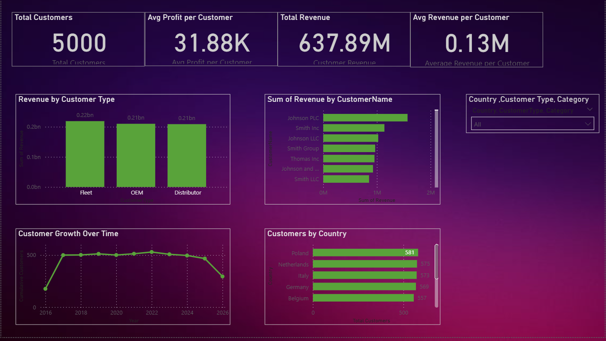
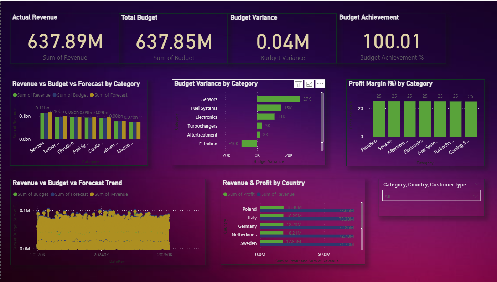
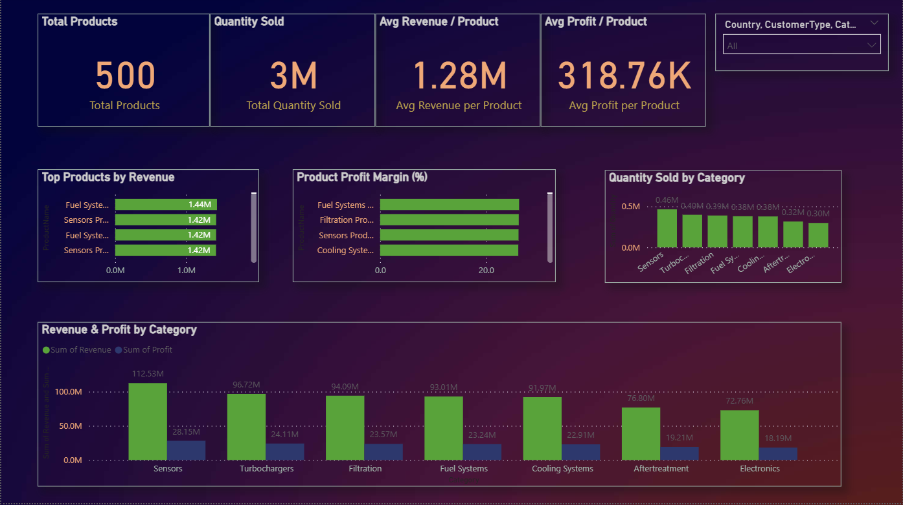

# 📊 Enterprise Business Performance Analytics


An end-to-end data analytics portfolio project demonstrating how **Python, SQL Server, and Power BI** can be used to generate, structure, analyze, and visualize enterprise financial and sales data.
## 🎯 Project Overview

The goal of this project was to build a complete analytics workflow from data generation to business intelligence reporting.

The project covers:

- Synthetic enterprise data generation using Python
- Data preparation using Pandas and NumPy
- SQL Server database and dimensional schema design
- SQL-based business analysis
- KPI development and analysis
- Interactive Power BI dashboard development
- Business performance visualization

The complete dataset contains approximately **250,000 financial transaction records**.

A lightweight **5,000-row sample dataset** is included in this repository for easy review.

> All data used in this project is synthetic and was created for learning and portfolio demonstration purposes.

---

## 🛠️ Tech Stack

| Area | Technology |
|---|---|
| Programming | Python |
| Data Manipulation | Pandas, NumPy |
| Synthetic Data | Faker |
| Notebook | Jupyter Notebook |
| Database | Microsoft SQL Server |
| SQL Environment | SQL Server Management Studio (SSMS) |
| Visualization | Power BI |
| BI Calculations | DAX |
| Version Control / Portfolio | GitHub |

---


## 🔄 Project Workflow

```text
Python / Jupyter Notebook
        ↓
Synthetic Enterprise Data Generation
        ↓
Data Preparation & Transformation
        ↓
CSV Dataset
        ↓
Microsoft SQL Server
        ↓
SQL Analysis
        ↓
Power BI Data Model
        ↓
DAX Measures & KPIs
        ↓
Interactive Business Dashboards
```

## 📊 Dashboard Previews

### 1. Business Performance Overview
.png)

### 2. Sales Performance
.png)

### 3. Customer Analytics


### 4. Financial Performance


### 5. Product Performance


