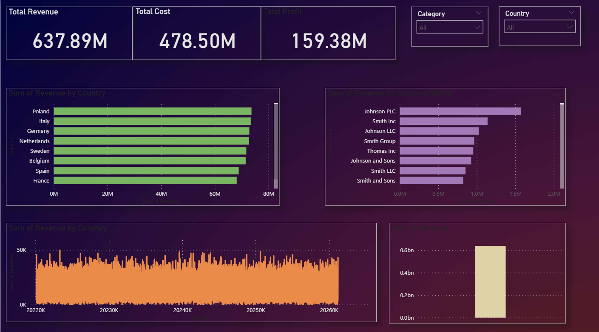
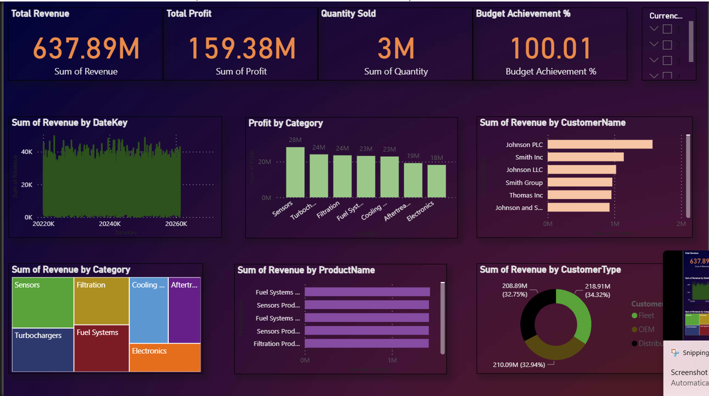

# Enterprise Business Performance Analytics

An end-to-end business intelligence project for analyzing sales, financial, customer, and product performance using **SQL Server, Python, and Power BI**.

The project covers the full workflow from synthetic data generation and database design to analytical modeling, DAX calculations, and interactive reporting.

## Overview

The objective was to build an enterprise reporting solution that allows business users to monitor performance across multiple dimensions and answer questions around revenue, profitability, customers, products, and budget performance.

The full dataset contains approximately **250,000 transaction records**. A smaller **5,000-row sample** is included in the repository for review.

All data used in this project is synthetic.

## Dashboard

The Power BI report consists of five pages designed for different areas of business analysis.

### Executive Overview

High-level view of revenue, profit, margin, budget performance, and business trends.



### Sales Performance

Analysis of sales trends and performance across regions, countries, and reporting periods.



### Customer Analysis

Customer-level analysis covering revenue contribution, customer growth, segmentation, and high-value accounts.


### Financial Performance

Analysis of revenue, cost, profit, margin, budget, forecast, and financial variance.


### Product Performance

Product and category-level analysis focused on revenue contribution, sales volume, and profitability.


## Business Requirements

The reporting solution was designed to answer the following questions:

- How are revenue and profitability changing over time?
- How does actual performance compare with budget and forecast?
- Which regions and countries contribute the most revenue?
- Which customers have the highest business value?
- How is the customer base developing over time?
- Which products and categories drive revenue and profit?
- Where are the main areas of underperformance?

## Data & Architecture

The analytical dataset contains transaction-level financial data connected to business dimensions including:

| Dimension | Example Attributes |
|---|---|
| Date | Reporting date and period |
| Product | Product, category, cost, list price |
| Customer | Customer, type, industry, location |
| Region | Geographic sales region |
| Salesperson | Sales ownership |
| Department | Business department |
| Currency | Transaction currency |

The overall workflow is:

```text
Python
  ↓
Data Generation & Preparation
  ↓
SQL Server
  ↓
Data Modeling & SQL Analysis
  ↓
Power BI
  ↓
DAX Measures
  ↓
Interactive Reporting
```

## Analysis

### SQL

SQL Server was used to structure the analytical data and perform business analysis before visualization.

Analysis included:

- Revenue and profit aggregation
- Time-based performance analysis
- Regional and country analysis
- Customer performance
- Product/category performance
- Budget and forecast comparison

### Power BI / DAX

The Power BI model was used to create reusable measures and interactive reporting logic.

Core measures include:

| Metric | Description |
|---|---|
| Revenue | Total sales revenue |
| Cost | Total transaction cost |
| Profit | Revenue less cost |
| Profit Margin % | Profit as a percentage of revenue |
| Budget Variance | Difference between actual and budget |
| Forecast Variance | Difference between actual and forecast |
| Customer Count | Distinct customer count |
| Customer Growth | Development of the customer base over time |
| Quantity Sold | Total units sold |

## Key Findings

This section documents the main findings identified during analysis.

- Revenue and profitability can be monitored across reporting periods and geographic markets.
- Customer analysis highlights differences in revenue contribution across accounts and segments.
- Product-level analysis makes it possible to distinguish high-revenue products from high-profit products.
- Budget and forecast comparisons provide visibility into areas where actual performance deviates from plan.

> Detailed numerical findings will be added as the analysis is finalized.

## Repository Structure

```text
enterprise-business-performance-analytics/
│
├── Images/
│   ├── 01_overview.png
│   ├── 02_sales.png
│   ├── 03_customers.png
│   ├── 04_financials.png
│   └── 05_products.png
│
├── data/
├── notebooks/
├── sql/
├── powerbi/
└── README.md
```

## Tools

**Python** — Pandas, NumPy, Faker  
**Database** — Microsoft SQL Server, SSMS  
**Business Intelligence** — Power BI, DAX  
**Development** — Jupyter Notebook  
**Version Control** — Git, GitHub

